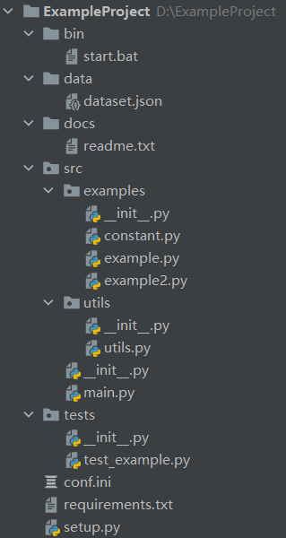

# 项目结构
## 前言

 **参考：** [Python最佳实践指南中文版](https://pythonguidecn.readthedocs.io/zh/latest/writing/structure.html)

“结构化”的定义是您关注于怎样使您的项目最好地满足它的对象性，我们需要去考虑如何更好地利用Python的特性来创造简洁、高效的代码。在实践层面，“结构化”意味着通过编写简洁的代码，并且正如文件系统中文件和目录的组织一样， 代码应该使逻辑和依赖清晰。

在一个健康的开发周期中，代码风格，API设计和自动化是非常关键的。同样的，对于工程的架构、仓库的结构也是关键的一部分。

当其他工程师查看或者接手您的工程（仓库）时，他们会看到这些:
-   工程的名字
-   工程的描述
-   一系列的文件
只有当他们滚动到目录下方时才会看到您工程（仓库）的README。

如果您的工程（仓库）的目录是一团糟，没有清晰的结构，他们可能要到处寻找才能找到您写的漂亮的文档。

样例：
```
Sample
├── LICENSE
├── README.md
├── setup.py
├── requirements.txt
├── example
│   └── example.py
│   └── __init__.py
├── docs
│   └── example.doc
└── tests
│   └── test_example.py
```

### 结构是一把钥匙

得益于Python提供的导入与管理模块的方式，结构化Python项目变得相对简单。 这里说的简单，指的是结构化过程没有太多约束限制而且模块导入功能容易掌握。 因而您只剩下架构性的工作，包括设计、实现项目各个模块，并整理清他们之间 的交互关系。

容易结构化的项目同样意味着它的结构化容易做得糟糕。糟糕结构的特征包括：

 - **多重且混乱的循环依赖关系**：例如，Student类中需要Teacher类，而同样的Teacher类需要引入Student类，这就是一种循环依赖。在这种情况下,您得借助一些不怎么靠谱的 小技巧，比如在方法或函数内部使用import语句。（[参考解决办法](https://www.codenong.com/s-python-circular-imports)）
 
 - **隐含耦合**：由于Student类与Teacher类会相会影响，各自的改变都可能会引起对方的改变。这样的情况意味着 Teacher类代码中包含了太多关于Student类的假设关联（相反亦是如此）。在这种情况下，我们应该尽量将这两个类的关系进行解耦，例如添加一个课程类或者班级类来将两者联系起来。

 - **大量使用全局变量或上下文**：大量的使用可以被修改而且是能被不同引用或者对象修改的全局变量，而不是通过准确的传递`class`，`id`这样确切的变量，那出现bug的时候您就需要彻底检查全局变量的**所有入口**，来理解为啥会发生这样的情况：两个老师为啥会在同一个班级教同一门课。
 
 - **面条式代码 (Spaghetti code)**：多页嵌套的if语句与for循环，包含大量复制-粘贴 的过程代码，且没有合适的分割——这样的代码被称为面条式代码。Python中有意思 的缩进排版(最具争议的特性之一)使面条式代码很难维持，尤其是在纯文本编辑器中，如vim等。
 - **混沌代码**：这类代码包含上百段相似的逻辑碎片，通常是缺乏 合适结构的类或对象。当你无法清晰定义1个类或者对象时，不知道是应该定义新的类还是继承原有的类、或者是否需要使用方法重载是，也许您已经陷入了混沌代码中。

## 工程结构 

**参考**： [Python 项目工程化开发指南](https://pyloong.github.io/pythonic-project-guidelines/guidelines/project_management/project_structure/)

### 简单结构
```
packaging_tutorial
├── LICENSE
├── README.md
├── example_pkg
│   └── __init__.py
│   └── example.py
├── setup.py
└── tests
```
项目结构以根目录开始，作为项目的环境。

当有多个同级包时，它们都是扁平的散落在项目根目录。项目根目录下可能还存在其他非包目录，如 `data` 、 `docs` 等。如果需要本地引用第三方库，也需要放到根目录，但第三方包并不是项目的子包，而是它的一个引用。这样做会造成职责混乱。如下：
```
tutorial
├── LICENSE
├── README.md
├── data
|   └── user.json
├── docs
│   └── history.md
├── user
│   └── __init__.py
├── views
│   └── __init__.py
├── requests            # 这是需要本地打包的第三方包
	└── request.py
│   └── __init__.py
├── setup.py
└── tests
```
当多个目录扁平的分布在项目根目录时，它们扮演者不同的功能，在开发上，会带了一定的混乱。而且在打包和测试上也会带来一些不便。

在打包上，需要提供 **更多的配置** 排除不必要的目录，如  `docs`  或者其他不需要打包仅项目中的东西。

当使用可编辑安装 `pip install -e .` 时，会将项目根目录中的所有东西安装到环境中，包括一些不需要的。

### src 结构

以下的src结构是社区逐渐遵守的一个标准。虽然社区中有大量老的项目依然采用简单布局，但新项目推荐使用 `src` 结构。如下面这个示例项目结构：
```
sampleproject
├── data
│   └── user.json
├── bin
│   └── start.bat
├── docs
│   └── history.md
├── setup.py
├── src
│   ├── requests
│   │   └── __init__.py
│   └── sample
│       ├── __init__.py
│       ├── user
│       │   └── __init__.py
│       └── views
│           └── __init__.py
│   ├── main.py
├── tests
│   ├── __init__.py
│   ├── user
│   │   └── __init__.py
│   └── views
│       └── __init__.py
└── conf.ini
└── settings.py
```
项目的包结构很清晰，在环境中只需要引入 `src` 目录，就可以轻松导入项目源代码。通过 `pip install -e .` 可编辑安装，也只会安装 `src` 中的包。管理起来更加清晰。



###  README

这应该是每个项目都应该有的一个文件，目的是能简要描述该项目的信息，让读者快速了解这个项目。
它需要说明以下几个事项:

 1. 软件定位，软件的基本功能。
 2. 运行代码的方法: 安装环境、启动命令等。
 3. 简要的使用说明。
 4. 代码目录结构说明，更详细点可以说明软件的基本原理。
 5. 常见问题说明。

在软件开发初期，由于开发过程中以上内容可能不明确或者发生变化，并不是一定要在一开始就将所有信息都补全。但是在项目完结的时候，是需要撰写这样的一个文档的。


### requirements.txt

这个文件存在的目的是:
方便开发者维护软件的包依赖。将开发过程中新增的包添加进这个列表中，避免在 `setup.py` 安装依赖时漏掉软件包。
方便读者明确项目使用了哪些Python包。
这个文件的格式是每一行包含一个包依赖的说明，通常是`numpy>=2.20.1` 这种格式，要求是这个格式能被 `pip` 识别，
这样就可以简单的通过 ` pip install -r requirements.txt` 来把所有Python包依赖都装好了。
当然，你也可以使用 `pip freeze > requirements.txt` 命令将你当前的环境所安装的包生成 `requirements.txt` 		
具体格式说明，请查看官方文档 [requirements](https://pip.pypa.io/en/stable/cli/)。
```txt
numpy >= 2.20
pandas 
docopt == 0.6.1
tqdm >= 3.4, <= 4.5
...
```

### setup

一般来说，用 `setup.py` 来管理代码的打包、安装、部署问题。业界标准的写法是用Python流行的打包工具`setuptools`来管理这些事情。
这种方式普遍应用于开源项目中。不过这里的核心思想不是用标准化的工具来解决这些问题，而是说，
一个项目一定要有一个安装部署工具，能快速便捷的在一台新机器上将环境装好、代码部署好和将程序运行起来。

`setuptools` 的文档比较庞大，刚接触的话，可能不太好找到切入点。学习技术的方式就是看他人是怎么用的，
可以参考一下Python的一个Web框架`Flask`是如何写的: [Flask setup.py](https://github.com/mitsuhiko/flask/blob/master/setup.py)

```python
from setuptools import setup

# Metadata goes in setup.cfg. These are here for GitHub's dependency graph.
setup(
    name="Flask",
    install_requires=[
        "Werkzeug >= 2.2.2",
        "Jinja2 >= 3.0",
        "itsdangerous >= 2.0",
        "click >= 8.0",
        "importlib-metadata >= 3.6.0; python_version < '3.10'",
    ],
    extras_require={
        "async": ["asgiref >= 3.2"],
        "dotenv": ["python-dotenv"],
    },
)
```

## 模块

**参考**：[Python最佳实践指南--模块](https://pythonguidecn.readthedocs.io/zh/latest/writing/structure.html#id8)

### 模块

Python模块是最主要的抽象层之一，并且很可能是最自然的一个。抽象层允许将代码分为 不同部分，每个部分包含相关的数据与功能。

例如在项目中，一层控制用户操作相关接口，另一层处理底层数据操作。最自然分开这两 层的方式是，在一份文件里重组所有功能接口，并将所有底层操作封装到另一个文件中。 这种情况下，接口文件需要导入封装底层操作的文件，可通过  `import`  和  `from  ...  import`  语句完成。一旦您使用 `import` 语句，就可以使用这个模块。 既可以是内置的模块包括  `os`  和  `sys`，也可以是已经安装的第三方的模块，或者项目内部的模块。

为遵守风格指南中的规定，模块名称要短，使用小写，并避免使用特殊符号，比如点(.) 和问号(?)。如 `my.spam.py` 这样的名字是必须不能用的！该方式命名将妨碍 Python的模块查找功能。就 `my.spam.py` 来说，Python 认为需要在 `my` 文件夹 中找到 `spam.py` 文件，实际并不是这样。如果愿意您可以将模块命名为 `my_spam.py`， 不过并不推荐在模块名中使用下划线。但是，在模块名称中使用其他字符（空格或连字号） 将阻止导入（`-`是减法运算符），因此请尽量保持模块名称简单，以无需分开单词。 最重要的是，不要使用下划线命名空间，而是使用子模块。

```python
# OK
import library.plugin.foo
# not OK
import library.foo_plugin
```

除了以上的命名限制外，Python文件成为模块没有其他特殊的要求，但为了合理地使用这 个观念并避免问题，您需要理解import的原理机制。具体来说，`import  modu`  语句将 寻找合适的文件，即调用目录下的  `modu.py`  文件（如果该文件存在）。如果没有 找到这份文件，Python解释器递归地在 "PYTHONPATH" 环境变量中查找该文件，如果仍没有找到，将抛出`ImportError`异常。

一旦找到  `modu.py`，Python解释器将在隔离的作用域内执行这个模块。所有顶层 语句都会被执行，包括其他的引用。方法与类的定义将会存储到模块的字典中。然后，这个 模块的变量、方法和类通过命名空间暴露给调用方，这是Python中特别有用和强大的核心概念。

也可以使用import语句的特殊形式 `from  modu  import  *` 模拟更标准的行为。但 `import  *` 通常 被认为是不好的做法。**使用**  `from  modu  import  *`  **的代码较难阅读而且依赖独立性不足**。 使用 `from  modu  import  func` 能精确定位您想导入的方法并将其放到全局命名空间中。 比 `from  modu  import  *` 要好些，因为它明确地指明往全局命名空间中导入了什么方法，它和 `import  modu` 相比唯一的优点是之后使用方法时可以少打点儿字。
除了简单的单文件项目外，其他项目需要能够明确指出类和方法 的出处，例如使用 `modu.func` 语句，这将显著提升代码的可读性和易理解性。

```python
# bad
from modu import *
x = sqrt(4)  # sqrt是模块modu的一部分么？或是内建函数么？上文定义了么？

# ok
from modu import sqrt
x = sqrt(4)  # 如果在import语句与这条语句之间，sqrt没有被重复定义，它也许是模块modu的一部分。

# good
import modu
x = modu.sqrt(4)  # sqrt显然是属于模块modu的。
```

### 包

Python提供非常简单的包管理系统，即简单地将模块管理机制扩展到一个目录上(目录扩展为包)。任意包含  `__init__.py`  文件的目录都被认为是一个Python包。导入一个包里不同 模块的方式和普通的导入模块方式相似，特别的地方是  `__init__.py`  文件将集合所有包范围内的定义。

`pack/`  目录下的  `modu.py`  文件通过  `import  pack.modu`  语句导入。 该语句会在  `pack`  目录下寻找  `__init__.py`  文件，并执行其中所有顶层 语句。以上操作之后，`modu.py`  内定义的所有变量、方法和类在`pack.modu`命名空 间中均可看到。

一个常见的问题是往  `__init__.py`  中加了过多代码，随着项目的复杂度增长， 目录结构越来越深，子包和更深嵌套的子包可能会出现。在这种情况下，导入多层嵌套的子包中的某个部件需要执行所有通过路径里碰到的  `__init__.py`  文件。如果包内的模块和子包没有代码共享的需求，使用空白的  `__init__.py`  文件是正常甚至好的做法。

最后，导入深层嵌套的包可用这个方便的语法：`import very.deep.module as mod`。 该语法允许使用 `mod` 替代冗长的  `very.deep.module`。

## 常见模块

### utils

utils模块，顾名思义，一般用于存放一些通用的工具函数，通过模块调用实现函数复用，减少代码重复，同时在主程序中隐藏程序细节。例如：`print_format(str)`，`print_time()`， `compute_date()`等等。

**什么样的函数适合放在utils？**

**工具类函数**，只负责某一个特定的功能，且不依附于某一个特定的类或者对象。简而言之就是**独立的**，**上下文无关的**，输入输出格式与主程序中自定义的类和对象无关，否则应该写在对于的类模块中。

例如，数据读取函数`load_dataset(filepath)`，该函数返回的格式必定与`dataset`需要的格式相关，无论返回的是一个`dataset`实例对象还是列表或者字典，一旦数据集定义发生变化，势必需要修改这个函数，因此这个函数应该从属与`dataset`，写在`dataset`模块中，而不是utils中。

当utils模块中的函数很多时，或者你感到臃肿时，比如代码行数已经超过400行或者函数个数超过15个，这时候你应该考虑将其拆分成若干个这样的模块了。安装功能细分，将拆分的`a_utils.py`，`b_utils.py`封装在一个utils包，让后使用`from utils import a_utils`去调用这些函数。 

**高阶技巧**：使用utils包中的__init__模块将这些子模块中的函数都加载进来，然后像之前一样使用`import utils`去调用这些函数。**但是不建议使用**。

### constants

全局常量模块，用于存放整个包甚至整个项目工程的全局变量。例如：数据，日志等文件夹所在路径；特定的数据。

虽然不建议将项目的启动配置参数也存放在这个模块当中，但是由于一些项目比较小，因此开发者会只使用1个全局常量模块来负责整个项目，一些项目的启动配置选项也存放其中。例如在一些深度学校开源项目经常可见：将模型运行参数都定义在constant中，如`batch_size`，`learning_rate`等等。

### configs & settings & options

**参考**： [Configure some options in the settings](https://www.zhihu.com/question/39827177)

程序所有的可变项叫做Settings。中文译作设置。所有的设置都是“可选项”，Option（选项，不是期权），因为在程序世界里没有真的开放式问题只有选择题（Option）。改变可选项的过程叫做Configure配置（动词）。

configs与settings两者没有太大的区别，且不同框架、软件有的使用configs，有的使用settings，随项目而定。
总而言之，该模块，一般用于系统全局环境的设置，例如数据库连接配置，服务器IP配置等等 。


